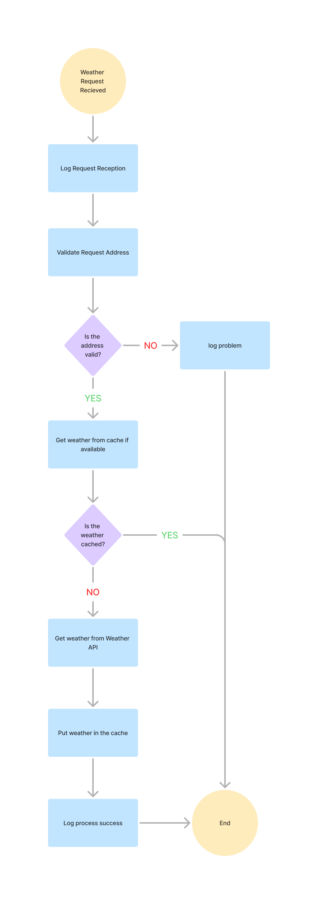

# Apple Weather Service

### Overview
<p>
This system is a simple web service middleware that takes an address and returns its current weather temperature.
</p>

Technologies used:
- Java
- Spring
- Maven
- slf4j
- Weather API
- Redis

It has 2 main parts which are:
- Weather data source([Weather API](https://www.weatherapi.com/))
- Weather cache(Redis)

The system is functional. Tested manually locally and unit by unit. <br/> There was not enough time to 
set up configurations and build outside of local host so **this will need to be ran locally preferably in an IDE**(was built using IntelliJ)

### Flow


### Software Requirements(to be installed before running)
- Java 
  - Must be 11
  - Download location: https://www.oracle.com/java/technologies/javase/jdk11-archive-downloads.html
- Redis 
  - Install instructions: https://redis.io/docs/latest/operate/oss_and_stack/install/install-redis/
- Maven
  - Download location: https://maven.apache.org/download.cgi
  - Install instructions: https://maven.apache.org/install.html

### Local Setup & Run
1. After the required software are installed, download dependencies using Maven either through an IDE or 
manually using Maven directly(`mvn compile`).

2. Build the system either through an IDE(steps depend on the IDE) or manually using Maven directly(`mvn package`). This should package the system into a `jar` file(`retton-1.0.0.jar`) inside a `target` directory.

3. Run Redis. The steps depend on what OS you're running on.

4. Run Apple Weather Service using an IDE(steps depend on the IDE) or manually using the Java binary command against the built `jar` file from step 2(`java -jar target/retton-1.0.0.jar`).

5. Once up and running,the system will be running on the default `localhost:8080`. A successful startup of the system will 
show a message **"Started RettonAssessment in 4.46 seconds (JVM running for 5.562)"** at the very bottom.

6. The location of the service for getting weather data is `localhost:8080/weather/get`. It uses an HTTP Get method with the address in the request body.
Sample request:
```
curl --location --request GET 'localhost:8080/weather/get' \
--header 'Content-Type: application/json' \
--data '{
    "street": "street",
    "supplementaryStreetDetails": "supplementaryStreetDetails",
    "city": "city",
    "state": "state",
    "postalCode": "85032",
    "country": "country"
}'
```

